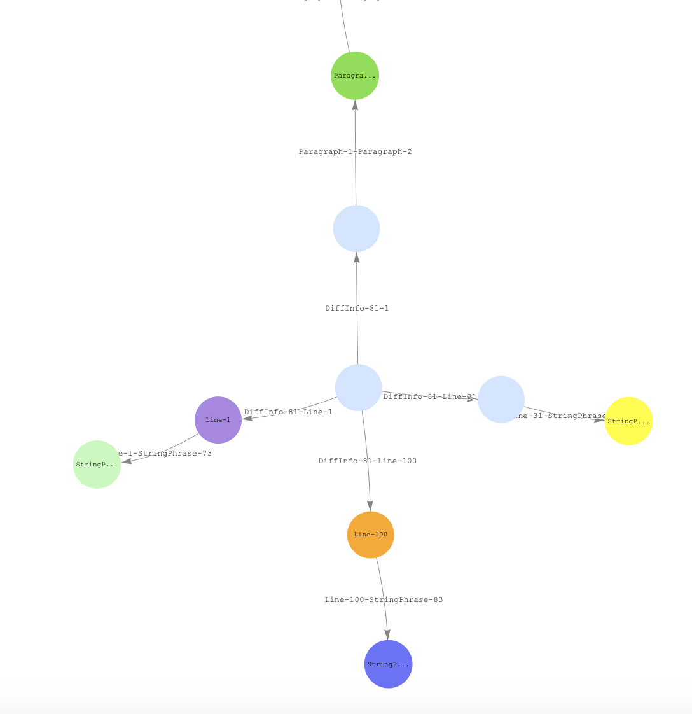

# diffOf

##### A tool that is used to perform diffs between any file to any file using a cli.

### Table of Contents

- [Supported Types](#supported-types)
- [Installation](#installation)
- [CLI](#cli)
- [Debugging](#debugging)

### Supported Types

JSON

### Installation

1. Clone this repo
2. `npm run bootstrap`
3. `npm run build`
4. `npm run start`

### CLI

1. Install this package globally: `npm i -g diffof`
2. `diffof file1.txt file2.txt`

```
Usage: diffof [options] [prevFilePath] [nextFilePath]

Options:
  --help               Show help                                       [boolean]
  --version            Show version number                             [boolean]
  --cp, --client-port  Client's port                    [number] [default: 3000]
  --sp, --server-port  Server's port                    [number] [default: 3001]
  --uk, --unique-key   Unique identifier of each document in the collection for
                       pairing between prev collection and next collection
                                                        [string] [default: "id"]
  --arraysByIndexOnly  Compares arrays by its indexes, order matters. If set to
                       false, will try to compare by values. If values are
                       complex types, will fallback to arraysByIndexOnly set to
                       true                                     [default: false]
```

### Debugging
#### VSCode
Debugging the server using VSCode is as simple as running `Debug server` configuration set in `.vscode/launch.json`. After that, set the breakpoints in the `.ts` files.

#### Graph

##### Requirements
Make sure docker-compose is installed on your machine: https://docs.docker.com/compose/install/

There's an option to view all relations visualized using a graph database.



Graph debugging is disabled by default and can be turned on using `npm run graph:debug`: This command will run a gremlin-server container, graph-notebook container and run the entire app with `GRAPH_ENABLED=TRUE` ENV variable.
The graph-notebook image also provides a sample working graph visualization notebook that can be accessed in `localhost:8888`.

**Graph notebook** image is available on DockerHub: https://hub.docker.com/repository/docker/barrman/graph-notebook and on GitHub: https://github.com/BarrMan/graph-notebook-docker

**Gremlin server** image is available on DockerHub: https://hub.docker.com/repository/docker/barrman/gremlin-server and on GitHub: https://github.com/BarrMan/gremlin-server

> `DocumentDiffStrategy` adds vertexes and edges to the graph and changes will be committed after each diff iteration.